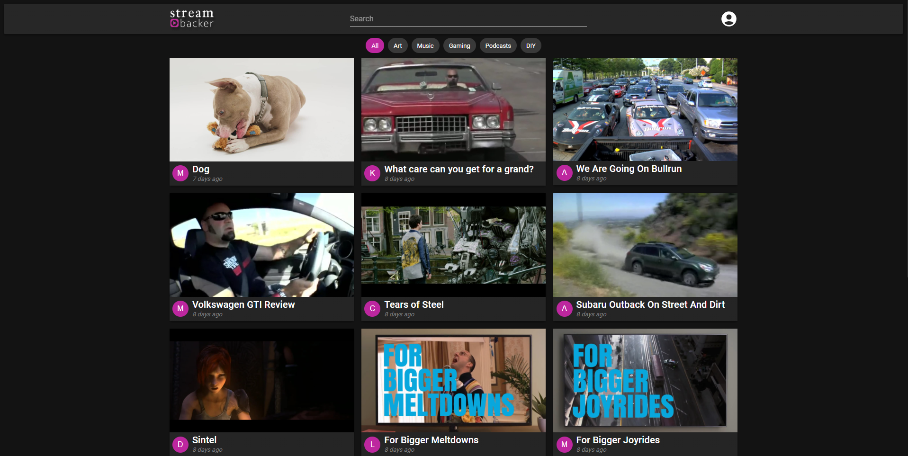
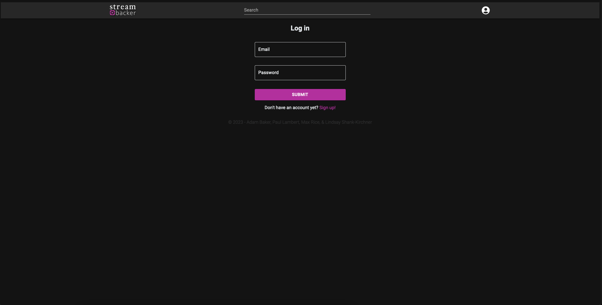
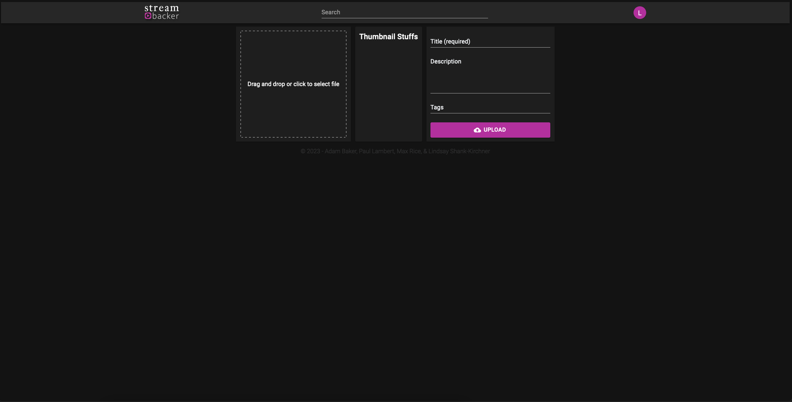

# Stream Backer

A media player for content creators developed using MERN stack.

## Repository Link
https://github.com/pclambs/stream-backer

## Deployed Heroku Link
https://stream-backer-668b75ae5120.herokuapp.com/

## Installation
Clone down repository
In the root of the directory run npm i to install dependencies
Create Cloudinary account & follow installation
Create .env file and add CLOUDINARY_URL with appropriate information
Run npm run seed to seed the database
Run npm run develop to launch server & GraphQL

## User Story

```
Our Group Concept

An app designed to have a media player site for digital creators to host their content.


``````

## Acceptance Criteria

Use React for the front end.

Use GraphQL with a Node.js and Express.js server.

Use MongoDB and the Mongoose ODM for the database.

Use queries and mutations for retrieving, adding, updating, and deleting data.

Be deployed using Heroku (with data).

Have a polished UI.

Be responsive.

Be interactive (i.e., accept and respond to user input).

Include authentication (JWT).


## Technology Utilized
```
React
Express.js
Node.js
MongoDB
Mongoose
GraphQL
MUI components
Heroku
```

## Resources Used 
```


```
## Screenshots





